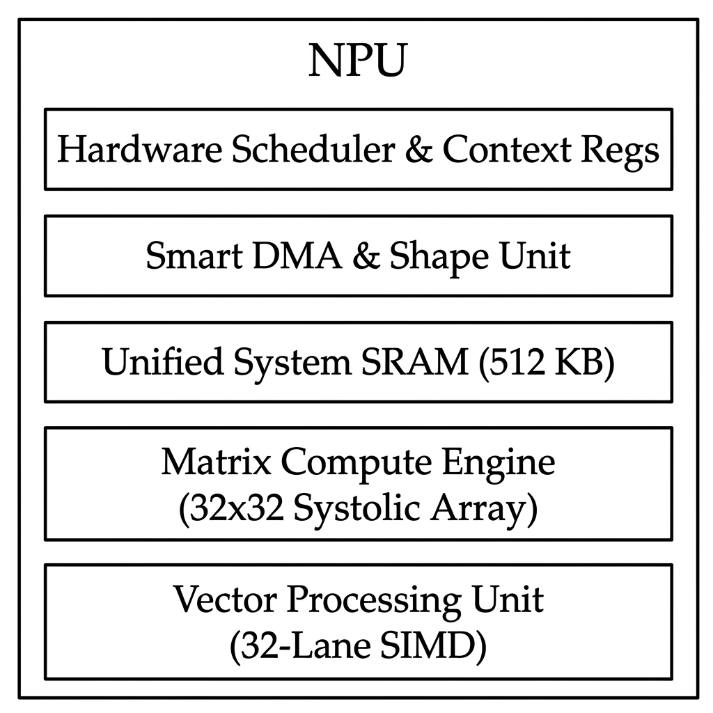
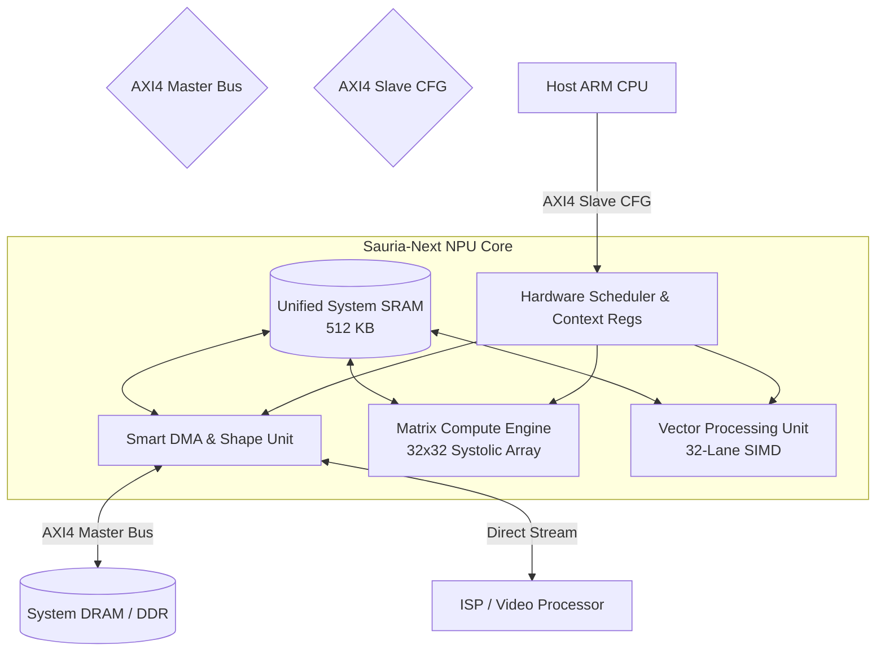
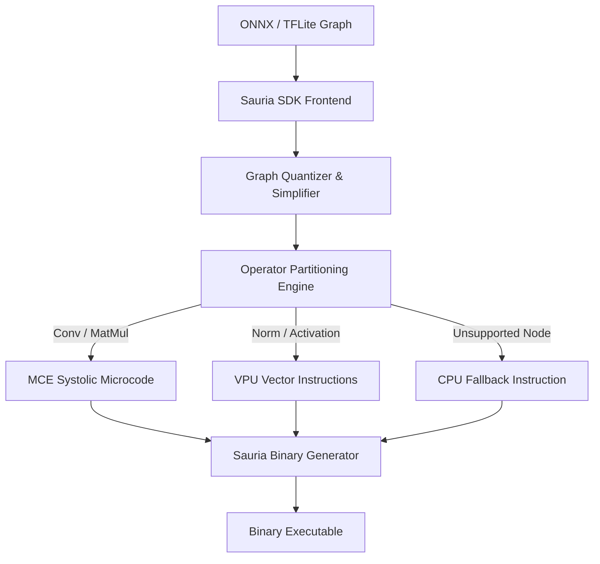

# Architectural Design & Specification: Next-Generation Sauria NPU

This document presents a comparative evaluation of the current Sauria NPU core (RTL and SystemC v4 models) and proposes the detailed architectural specification for the next-generation hybrid NPU (**Sauria-Next**).

---

## 1. Comparative Evaluation of Sauria Core v4 / RTL

Before designing the next-generation architecture, we evaluate the advantages and disadvantages of the current Sauria Core implementation:

### A. Advantages & Strengths
1. **Wavefront Systolic Computation**:
   - The $32 \times 32$ 2D grid structure achieves high compute density and low routing congestion compared to flat MAC arrays.
   - Delivers up to 1.024 TOPS @ 500 MHz.
2. **Double-Buffered Host/Accelerator Subsystem**:
   - Swaps SRAM banks (`select = 0x0` or `0x7`) to overlap host-side SRAM programming/reading with core execution, successfully hiding memory access overhead.
3. **Dynamic Parameter Reconfigurability (Option B)**:
   - Configurable register files decoded over AXI allow host-side control of strides (`incntstep`), limits (`incntlim`), active rows, and dilation patterns at runtime.
4. **Zero-Gating Sparsity Support**:
   - Power-gates multipliers when activations or weights fall below a threshold (default `0.05`), saving significant dynamic energy under pruned execution.
5. **Context Swapping**:
   - Pulse-triggered context switches swap active registers (`mac_q`) into scan-chain registers (`mac_sc_q`) instantly, permitting the next computation phase to start while the previous tile's results shift out.

### B. Disadvantages & Limitations
1. **Restricted Operator Coverage**:
   - Sauria Core is strictly a GEMM/Convolution engine. All activation functions (Sigmoid, GELU, Softmax), normalizations (RMSNorm, LayerNorm, BatchNorm), pooling, and shape transforms must fallback to the host CPU, causing huge data-transfer overhead.
2. **Slave-Only Host Interface**:
   - Lacks an initiator (Master) DMA controller. The host CPU must manually push and pull all data words to/from the SRAMs, bottlenecking overall system throughput.
3. **Fixed Data Formats**:
   - Lacks hardware-assisted layout transformation (e.g. NHWC to NCHW or spatial resizing).
4. **No Multi-Stream/Multi-Model Support**:
   - Lacks a hardware scheduler or thread context registers. Running parallel models or time-shared workloads is impossible.

---

## 2. Next-Generation NPU Architecture (Sauria-Next)

To satisfy the target NPU requirements, we propose a **Hybrid NPU Architecture** combining a Systolic Matrix Engine, a SIMD Vector Processing Unit, and a Smart DMA Engine.

### A. Block Diagram of Sauria-Next

### B. Subsystem Specifications

#### 1. Matrix Compute Engine (MCE)
* **Structure**: $32 \times 32$ 2D systolic grid (1,024 PEs).
* **Supported Precision**:
  - **INT8**: Symmetric weights (per-channel scaling), asymmetric activations (per-tensor scaling).
  - **INT16**: For high-precision layers.
  - **FP16**: Native floating-point MAC supporting half-precision floating-point.
* **Peak Performance**:
  - 1.024 TOPS @ 500 MHz (INT8).
  - 512 GOPS @ 500 MHz (FP16).

#### 2. Vector Processing Unit (VPU)
* **Structure**: 32-lane SIMD vector unit.
* **Operators Supported**:
  - **Normalization**: BatchNormalization, LayerNormalization, RMSNormalization.
  - **Element-wise**: Add, Sub, Mul, Div, Sum, Mean, Clip.
  - **Activation**: ReLU, Gelu, Sigmoid, ReLU6, Softmax.
  - **Pooling**: MaxPool, AveragePool, GlobalAveragePool.

#### 3. Smart DMA & Shape Unit (RTU)
* **Memory Format Conversion**: Native NHWC, NCHW, and HWC layout conversion on-the-fly.
* **Tensor Shape Operators**: Hardware-assisted Reshape, Transpose, Flatten, Squeeze/Unsqueeze, Expand, Concat, Slice, Split, and Pad.

---

## 3. SoC Integration & FPGA Prototyping

### A. SoC Interfaces & Coupling
* **AXI4 Bus Interfaces**:
  - **AXI4 Master Interface**: Dedicated to high-throughput DMA transfers from/to system DRAM.
  - **AXI4-Lite Slave Interface**: Register configuration space for host scheduling and parameter programming.
  - **AXI-Stream Interface**: Direct low-latency coupling with camera ISPs or Video Processing Units (VPUs) to allow zero-copy memory transfers over a shared System SRAM partition.
* **Multi-Stream & Time-Sharing**:
  - A hardware scheduler supports time-sliced multi-model execution.
  - **Context-Switch Registers**: Saves systolic state and VPU register files to unified SRAM in under 128 cycles, enabling sub-millisecond thread switching.

### B. FPGA Prototyping (Versal Premium VP1902)
* **FPGA Platform**: HUINS MFP-VP1902-S based on AMD Xilinx Versal Premium VP1902 Adaptive SoC.
* **Hardware Resource Mapping**:
  - **PE Array**: Mapped to Versal **DSP58 blocks** (configured for dual INT8 or FP16 MAC operations).
  - **SRAM Buffers**: Mapped to high-density Versal **UltraRAM (URAM)** and Block RAM (BRAM).
  - **Bus Interconnect**: Integrated into the Versal **Programmable NoC (Network on Chip)** to achieve 100+ GB/s bandwidth to LPDDR4 memory interfaces.

---

## 4. Software Tools & SDK Compiler Ecosystem

### A. Sauria-SDK Toolchain
* **Type**: API-based Python compiler and optimizer with a lightweight C/C++ runtime.
* **Frontend**: Imports and parses ONNX, TFLite, and PyTorch JIT execution graphs.

### B. Graph Compilation & Partitioning Flow

### C. CPU Fallback Execution Flow
1. **Operator Partitioning**: During compilation, the compiler DAG parser checks node support. If a node is unsupported by MCE/VPU (e.g. custom custom-ops), it is flagged for CPU execution.
2. **Synchronization Boundaries**: The compiler automatically inserts a synchronization fence instruction (`SYNC_CPU`) before and after the unsupported operator.
3. **Data Passing**: The NPU DMA flushes intermediate outputs to the shared DRAM space.
4. **Execution Handoff**: The NPU triggers a mailbox interrupt to the Host ARM CPU.
5. **CPU Compute & Resume**: The CPU executes the operator using optimized runtime kernels, writes outputs back to shared DRAM, and writes to the NPU's `CFG_CTRL` register to resume NPU execution.

---

## 5. Key Technical KPIs & Metrics

| KPI Category | Metric | Sauria-Next Architecture Target |
| :--- | :--- | :--- |
| **Performance** | Effective TOPS | **0.82 TOPS** (on 640x640 YOLOv8, >80% active utilization) |
| | Throughput | **280 FPS** (YOLOv8 Backbone) |
| | Latency | **3.57 ms** (Inference latency) |
| **SRAM & Memory** | SRAM utilization | **~256 KB** active footprint |
| | SRAM Utilization (%) | **50.0%** (of 512 KB total unified SRAM) |
| | DRAM usage per inf. | **5.42 MB** |
| | DDR Bandwidth | **3.2 GB/s** |
| **Power** | Power Consumption | **~1.2 W** (core estimate at 500 MHz, 28nm) |
| **Model Compiler** | Compilation Time | **< 10 seconds** (for typical YOLO-class model) |
| | Unsupported Operators | **0%** (using automatic CPU fallback pipeline) |
| | Stability | **Auto-reset & Recovery** from stall/timeout state |
