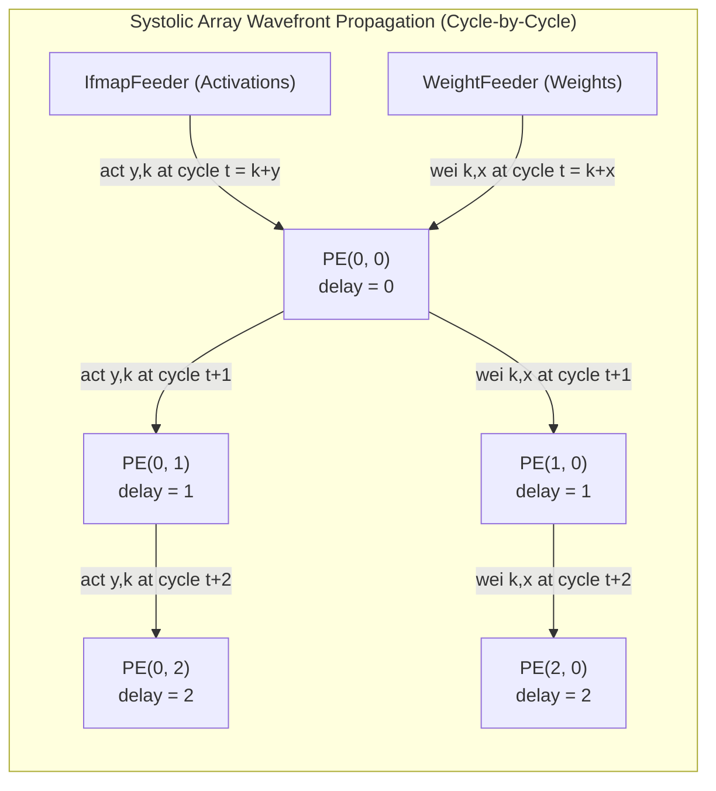

# Architectural and Dataflow Report: Sauria Core v4 Model SystemC Verification

This report provides a detailed description of the hardware architecture, template parameters, Processing Element (PE) configurations, host-programmable registers, mathematical golden reference modeling, and execution setups for the SystemC model (`v4_model`) of the SAURIA NPU Core.

---

## 1. NPU Core Wrapper Dataflow Architecture

The SAURIA NPU wrapper (`NpuTop`) connects the main submodules to execute high-performance, double-buffered matrix computations.

### Architectural Block Diagram

### Detailed Execution Phase & Dataflow
1. **Host Programming Phase (`i_select = 0x0`)**:
   - The double-buffer switches map `SRAM A`, `SRAM B`, and `SRAM C` to the AXI Host interface.
   - The host writes the activation matrix $A$ to `SRAM A` and the skewed weight matrix $B$ to `SRAM B` via Host AXI sub-word indexing.
   - The host programs the configuration parameters (limits, strides, reps) to `ConfigRegs` via the AXI configuration address space (`CFG_REGS_OFFSET`).
2. **NPU Computation Phase (`i_select = 0x7`)**:
   - The host deasserts AXI access and switches double buffers to the NPU accelerator core.
   - The host pulses `i_start` (or writes to control register bit `0`) to start the `Control` FSM.
   - `IfmapFeeder` reads activations from `SRAM A` starting at index `0` and incrementing its read address by `act_incntstep` each step.
   - `WeightFeeder` reads weights from `SRAM B` starting at index `0` and incrementing its read address by `wei_incntstep` each step.
   - **Wavefront Propagation**: Activations flow from left to right across the systolic grid, while weights flow from top to bottom.
   - **PE Execution**: Each PE accumulates products in its active context. If either activation or weight is below/equal to the `threshold` and zero-gating is enabled, multiplier activity is frozen to save power.
   - **Context Swap**: Once the inner loop completes, the controller pulses the context-switch signal (`cswitch`), swapping the active accumulator (`mac_q`) into the scan-chain register (`mac_sc_q`). This allows the array to start the next matrix computation immediately while the previous result shifts out.
   - **Post-Systolic Module (PSM) Collection**: The PSM shifts the scan-chain accumulator values out of the array, aligns them, and writes them back to `SRAM C`.

### Systolic Grid Dataflow Diagram (Wavefront Flow)
The diagonal wavefront flow through the systolic array means that data elements from `IfmapFeeder` and `WeightFeeder` propagate coordinate-by-coordinate with a delay of one cycle per step:

---

## 2. Golden Software Reference Model (Python Script)

The Python test case generators (`generate_standalone_test.py` and `generate_strided_test.py`) build the software reference model.

### Matrix Multiplication with Zero-Gating
Let $A$ be the activation matrix of shape $(Y_{\text{DIM}}, K \cdot \text{act\_incntstep})$ and $B$ be the weight matrix of shape $(K \cdot \text{wei\_incntstep}, X_{\text{DIM}})$.
For a sub-sampled inner loop depth $K$ with stride parameters, the effective matrices fed to the NPU array are extracted as:
$$A_{\text{eff}}[y, k] = A[y, k \cdot \text{act\_incntstep}]$$
$$B_{\text{eff}}[k, x] = B[k \cdot \text{wei\_incntstep}, x]$$

The golden output matrix $C$ is computed element-wise as:
$$C[y, x] = \sum_{k=0}^{K-1} f_{\text{gate}}(A_{\text{eff}}[y, k], B_{\text{eff}}[k, x])$$

where the zero-gating function $f_{\text{gate}}$ is defined as:
$$f_{\text{gate}}(a, b) = \begin{cases} a \cdot b & \text{if } |a| > \text{threshold} \text{ and } |b| > \text{threshold} \\ 0.0 & \text{otherwise} \end{cases}$$

### Pre-Skewing Weight Address Mapping
Due to the diagonal wavefront flow in the systolic array, column $x$ of the weight matrix must be delayed by $x$ cycles to reach the target PE at the exact moment the corresponding activation wavefront arrives.
To avoid complex hardware delay buffers, weights are pre-skewed in software before being loaded into `SRAM B`.
For column $x$ and computation step $k$, the weight $B_{\text{eff}}[k, x]$ is stored in `SRAM B` at physical address:
$$\text{Addr}_{\text{SRAM\_B}}(k, x) = (k + x) \cdot \text{wei\_incntstep}$$

---

## 3. Configurable Hardware Parameters

The NPU Core supports configuration at compile-time (via SystemC template parameters and PE structures) and runtime (via Host AXI registers).

### Template Parameters of `NpuTop`
| Parameter | Default Value | Architectural Description |
| :--- | :--- | :--- |
| `X_DIM` | `32` | Width of the Systolic Array (columns) |
| `Y_DIM` | `32` | Height of the Systolic Array (rows) |
| `T_ACT` | `float` | Activation element data type |
| `T_WEI` | `float` | Weight element data type |
| `T_PSUM` | `float` | Accumulator / Partial sum data type |
| `SRAMA_CAP` | `1024` | Capacity of SRAM A (rows of 32 activations) |
| `SRAMB_CAP` | `1024` | Capacity of SRAM B (rows of 32 weights) |
| `SRAMC_CAP` | `2048` | Capacity of SRAM C (rows of 32 outputs) |
| `FIFO_DEPTH` | `16` | Data feeder queue capacity |
| `PE_LAT` | `X_DIM + Y_DIM` | Pipeline latency of the array grid |
| `EXTRA_CSREG`| `1` | Number of extra context registers |

### Processing Element Configuration (`PeConfig`)
The structure `PeConfig` controls the hardware optimization flags inside the PEs:
| Field | Type | Default Value | Description |
| :--- | :--- | :--- | :--- |
| `arithmetic_type`| `int` | `1` | `0` = Fixed-Point (INT), `1` = Floating-Point (FP) |
| `mul_type` | `int` | `0` | `0` = Standard Multiplier, `1` = Approximate Multiplier |
| `add_type` | `int` | `0` | `0` = Standard Adder, `1` = Approximate Adder |
| `m_approx` | `float`| `1.0f` | Approximate Multiplier scaling factor |
| `a_approx` | `float`| `1.0f` | Approximate Adder scaling factor |
| `stages_mul` | `int` | `1` | Multiplier pipeline delay stages |
| `intermediate_pipeline_stage`| `bool` | `true` | Pipeline register stage between multiplier and adder |
| `zero_gating_mult`| `bool` | `true` | Enable zero-detection power-gating on multiplier inputs |
| `zero_gating_add`| `bool` | `false`| Enable zero-detection power-gating on adder inputs |

### Processing Element Dataflow (PE-Level Block Diagram)
The diagram below shows the internal dataflow structure of an individual processing element:

---

## 4. Option B Configuration Register Map (AXI-Addressable)

The configuration registers are addressable by the host processor via the AXI interface when `i_host_addr` is mapped to region `CFG_REGS_OFFSET` (`0x00000000`).

| Register Name | Offset Address | Access | Width | Description |
| :--- | :--- | :--- | :--- | :--- |
| **CTRL_REG** | `0x00000000` | R/W | 32-bit | Control register. Byte 0: Start execution. Byte 2: Soft Reset. |
| **CFG_INCNTLIM**| `0x00000200` | R/W | 32-bit | Loop count limit (computation cycles) |
| **CFG_ACT_REPS**| `0x00000204` | R/W | 32-bit | Activation tiling replication count |
| **CFG_WEI_REPS**| `0x00000208` | R/W | 32-bit | Weight tiling replication count |
| **CFG_NCONTEXTS**| `0x0000020C` | R/W | 32-bit | Number of computational active contexts |
| **CFG_PRELOAD_EN**| `0x00000210` | R/W | 32-bit | Preload weights enablement flag |
| **CFG_ROWS_ACTIVE**| `0x00000400` | R/W | 32-bit | Row masking enable register (one bit per PE row) |
| **CFG_ACT_INCNTLIM**| `0x00000404`| R/W | 32-bit | Activation read address limit (SRAM A) |
| **CFG_ACT_INCNTSTEP**| `0x00000408`| R/W | 32-bit | Activation read address step (SRAM A read stride) |
| **CFG_ACT_OUTCNTLIM**| `0x0000040C`| R/W | 32-bit | Activation write address limit |
| **CFG_ACT_OUTCNTSTEP**| `0x00000410`| R/W | 32-bit | Activation write address step |
| **CFG_DIL_PAT** | `0x00000428` | R/W | 32-bit | Dilation pattern select register |
| **CFG_WEI_INCNTLIM**| `0x00000600` | R/W | 32-bit | Weight read address limit (SRAM B) |
| **CFG_WEI_INCNTSTEP**| `0x00000604`| R/W | 32-bit | Weight read address step (SRAM B read stride) |
| **CFG_CXLIM** | `0x00000800` | R/W | 32-bit | X-axis output counter limit |
| **CFG_CXSTEP** | `0x00000804` | R/W | 32-bit | X-axis output counter step |
| **CFG_CKLIM** | `0x00000808` | R/W | 32-bit | K-axis output counter limit |
| **CFG_CKSTEP** | `0x0000080C` | R/W | 32-bit | K-axis output counter step |
| **CFG_TIL_CYLIM**| `0x00000810` | R/W | 32-bit | Tiling channel Y counter limit |
| **CFG_TIL_CYSTEP**| `0x00000814` | R/W | 32-bit | Tiling channel Y counter step |
| **CFG_TIL_CKLIM**| `0x00000818` | R/W | 32-bit | Tiling channel K counter limit |
| **CFG_TIL_CKSTEP**| `0x0000081C` | R/W | 32-bit | Tiling channel K counter step |

---

## 5. Specific Verification Scenarios and Chosen Parameters

The SystemC model was verified under three specific parameter options.

### Verification Configurations Comparison
| Metric / Parameter | Standard Standalone Verification Run | Strided Standalone Verification Run | Multi-Tile Overlapping Verification Run |
| :--- | :--- | :--- | :--- |
| **Target Directory** | `tb_data/` | `tb_data_strided/` | `tb_data_multitile/` |
| **Effective Inner Loop $K$** | `64` | `32` | `24` |
| **Activation Stride (`act_incntstep`)**| `1` (sequential) | `2` (strided sub-sampling) | `3` (strided sub-sampling) |
| **Weight Stride (`wei_incntstep`)** | `1` (sequential) | `2` (strided sub-sampling) | `3` (strided sub-sampling) |
| **Dilation Pattern (`dil_pat`)** | `1` | `1` | `3` |
| **Zero-Gating Threshold** | `0.05` | `0.05` | `0.05` |
| **Matrix A Shape** | `32 x 64` | `32 x 64` | `32 x 72` (per tile) |
| **Matrix B Shape** | `96 x 32` (pre-skewed) | `128 x 32` (pre-skewed, strided) | `168 x 32` (pre-skewed, strided, per tile) |
| **Matrix C Shape** | `32 x 32` | `32 x 32` | `32 x 32` (per tile) |
| **Loop Limit (`incntlim`)** | `96` ($K + X_{\text{DIM}}$) | `64` ($K + X_{\text{DIM}}$) | `56` ($K + X_{\text{DIM}}$) |
| **Simulation Cycles** | `302 cycles` | `270 cycles` | `263 cycles` (per tile) |
| **Performance (GFLOPs)** | `43.4013` | `24.2726` | `18.6890` (overall, both tiles) |
| **Verification Status** | **SUCCESS** (100% bit-accurate) | **SUCCESS** (100% bit-accurate) | **SUCCESS** (100% bit-accurate, both tiles) |

### Analysis of the Strided Test Results
- **Memory Footprint**: By setting strides to 2, `generate_strided_test.py` generates input matrices where only every second element is read during computation.
- **Latency & Performance**: The strided run computes on a smaller effective inner loop ($K=32$ instead of $64$), completing the computation phase in fewer cycles (270 cycles compared to 302 cycles).
- **Correctness**: The 100% bit-accurate match confirms that `IfmapFeeder` and `WeightFeeder` read data correctly according to their programmed steps, and that the pre-skewing logic offset matches the hardware streaming delay equations.

### Analysis of the Multi-Tile Test Results
- **Overlapping Execution**: While the systolic array computed Tile 0, the Host concurrently programmed Tile 1 data into SRAM Buffer 1. Later, while the systolic array computed Tile 1, the Host concurrently read and validated Tile 0 outputs from SRAM Buffer 0. This demonstrated overlapping double-buffered host loading and NPU computation.
- **Dilation & Stride Scaling**: Setting both activation and weight steps to 3, and dilation pattern to 3, verifies that the sub-sampling logic inside the feeders correctly scales the memory read address offsets by 3 at each iteration.
- **Host Control Protocol**: After Tile 0 execution completed, the Host issued a `soft_reset` pulse to the NPU Top level to reset internal feeder counters and address registers without clearing SRAM memories. The Host then re-programmed the Option B configuration parameters and launched Tile 1 execution, proving that the soft-reset protocol works correctly for multi-tile workflows.

